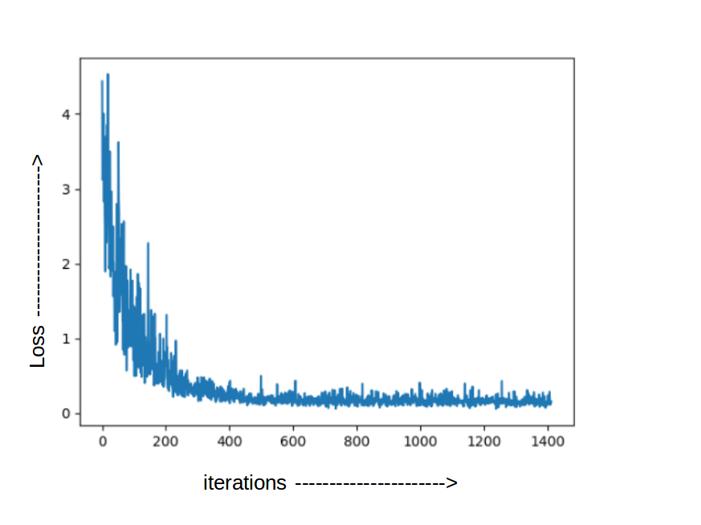
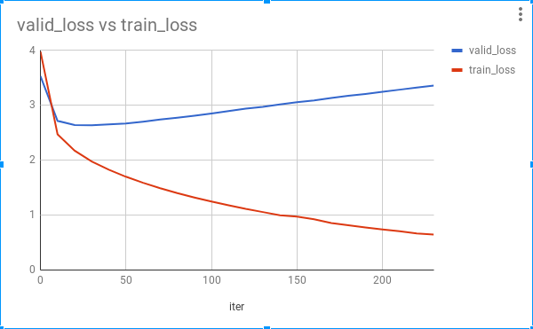

# pytorch-image-captioning

## Abstract
In this project, I have implemented an end-to-end Deep Learning model for Image Captioning. The architecture consists of Encoder and Decoder Networks. Encoder is one of the pre-trained CNN architectures to get image embedding. Decoder is LSTM network with un-intialized word embeddings.

## Requirements
1. python3.6 
2. [pytorch](http://download.pytorch.org/whl/cu90/torch-0.4.0-cp36-cp36m-linux_x86_64.whl) 
3. pytorch-vision 
4. pillow 
5. nltk  
6. pickle 
7. cuda version 9.0/9.1
8. cuDNN >=7.0

```bash
pip install http://download.pytorch.org/whl/cu90/torch-0.4.0-cp36-cp36m-linux_x86_64.whl pytorch-vision pillow nltk pickle
```

## Dataset
[Flickr8K](http://www.jair.org/papers/paper3994.html) <br>
#train : 6000 <br>
#dev : 1000 <br>
#test : 1000 <br>

## Instructions to run the code

### 1. Pre-Processing
```bash
python3 Preprocess.py
```

### 2. Train 
```bash
python3 train.py -model <encoder_architecture> -dir <train_dir_path> -save_iter <model_checkpoint> -learning_rate <learning_rate> -epoch <re-train_epoch> -gpu_device <gpu_device_number> -hidden_dim <lstm_hidden_state_dim> -embedding_dim <encoder_output>
```
##### args:

 `-model`        :   one of the cnn architectures - alexnet, resnet18, resnet152, vgg, inception, squeeze, dense<br>
` -dir`          : training directory path<br>
` -save_iter`    : create model checkpoint after some iterations, default = 10<br>
` -learning_rate`: default = 1e-5<br>
` -epoch`        : re-train the network from saved checkpoint epoch<br>
` -gpu_device`   : gpu device number in case multiple gpus are installed on server<br>
` -hidden_dim`   : number of neurons for lstm's hidden state, default = 512<br>
` -embedding_dim`: output of cnn encode model, default = 512<br>


### 3. Test
```bash
python3 test.py -model <encoder_architecture> -i <image_path> -epoch <saved_model> -gpu_device <gpu_device_number>
```
##### args: 

` -i` : image path for generating caption <br>
 
 [Download trained model](https://drive.google.com/open?id=1xF8dfIDsz57ZrX7bKApOakyjm1GoelJm): Trained for ~24 hours (230 iterations) on single NVIDIA 1080 (8GB) GTX GPU. 
 
## Results
### Check whether the model is training or not by overfitting on small dataset.

Since training error is decreasing it seems like model is working just fine.

### Train vs validation loss
[](https://docs.google.com/spreadsheets/d/1VBz6r91D6P_9rybGmbaVNm-P1PM-xcnIWQ0wxQOWFzM/edit?usp=sharing)


Image  |Original Captions|Predicted Captions
----|----|----
   | 1. a beagle and a golden retriever wrestling in the grass <br> 2. Two dogs are wrestling in the grass <br> 3. Two puppies are playing in the green grass <br> 4. two puppies playing around in the grass <br> 5. Two puppies play in the grass | 50. a brown and white dog is running through a grassy field . <br> 100. a brown dog in a field .  <br> 150. a brown dog is running through a grassy field .  <br> 200. **a brown and white dog is laying with its mouth open and people up in the grass .** <br> 230. a brown dog running through grass .<br>
    |  1. a brightly decorated bicycle with cart with people walking around in the background  <br> 2. A street vending machine is parked while people walk by  <br> 3. A street vendor on the corner of a busy intersection  <br> 4. People on the city street walk past a puppet theater  <br> 5. People walk around a mobile puppet theater in a big city . | 50. a man with a green shirt is standing in front of a &lt;unk&gt; at a &lt;unk&gt; . <br> 100.  a group of people standing outside a building . <br> 150. a group of people standing around a outside of building . <br> 200.  **a group of people are standing around a city street .** <br> 230.  a man in a green shirt &lt;unk&gt; a &lt;unk&gt; at a carnival .  <br>
    | 1. A boat is on the water , with mountains in the background . <br> 2. A boat on the water .<br> 3. A lone boat sitting in the water . <br> 4. A white boat on glassy water with mountains in the background .<br> 5. This is a boat on the water with mountains in the background .  <br>  | 0. a man is on a &lt;unk&gt; . <br> 30.  a person on a surfboard is standing on a beach . <br> 130. a person is standing on a mountain and overlooking the ocean . <br> 230. **a person is standing on a rock and overlooking the ocean .** <br>  
    | 1. A woman climbs up a cliff. <br> 2. A woman rock climber scales a cliff far above pastures .<br> 3. A woman rock-climbing on a cliff . <br> 4. A woman rock-climbs in a rural area .<br> 5. Woman climbing a cliff in a rural area  <br>  | 0. a man in a red and a &lt;unk&gt; is on a &lt;unk&gt;  <br> 30. **a man in a red shirt is climbing a rock .** <br> 130. a man in a red shirt is rock climbing . <br> 230. a man in a red shirt and green pants climbs a rock cliff .<br>  
    | 1. Hikers cross a bridge over a fast moving stream and rocky scenery .<br> 2. People crossing a long bridge over a canyon with a river .<br> 3. People walk across a rope bridge over a rocky stream . <br> 4. Some hikers are crossing a wood and wire bridge over a river .<br> 5. Three people are looking across a rope and wood bridge over a river . <br>  | 0. a man in a red of a &lt;unk&gt; . <br> 30. a person in a blue jacket is jumping in the snow .<br> 130. a person in the snow .<br> 230.  **a person on a snowboard in the air** <br>  
    |  1. Two men in ethnic dress standing in a barren landscape . <br> 2. Two men in keffiyahs stand next to car in the desert and wave at a passing vehicle .<br> 3. Two men in robes wave at an approaching jeep traveling through the sand . <br> 4. Two men in traditional Arab dress standing near a car wave at an SUV in the desert .<br> 5. Two people with head coverings stand in a sandy field .  <br>  | 0.  a man in a red and a white and a dog is on a &lt;unk&gt; . <br> 30. a man and a woman are standing on a bench in a park .<br> 130. **a man and a woman dressed in &lt;unk&gt; are walking along a dirt road .** <br> 230. a man holding a camera and a woman is walking with her hands on a jumping away from a <br>  
    | 1. A man mountain climbing up an icy mountain . <br> 2. An climber is ascending an ice covered rock face .<br> 3. A person in orange climbs a sheer cliff face covered in snow and ice . <br> 4. Person in a yellow jacket is climbing up snow covered rocks .<br> 5. There is a climber scaling a snowy mountainside .  <br>  | 0. a dog is in the water .<br> 30. a man in a yellow shirt is standing in front of a waterfall . <br> 130. a lone climber walks along a rocky path with mountains in the background .  <br> 230.  **a man climbing a huge mountain .** <br>  
    | 1. A boy with a stick kneeling in front of a goalie net <br> 2. A child in a red jacket playing street hockey guarding a goal .<br> 3. A young kid playing the goalie in a hockey rink . <br> 4. A young male kneeling in front of a hockey goal with a hockey stick in his right hand .<br> 5. Hockey goalie boy in red jacket crouches by goal , with stick .  <br>  | 0.  a man in a red shirt and a red and a white dog is on a &lt;unk&gt; . <br> 30. aa man and a woman are sitting on a red bench .<br> 130.  a man in a red shirt and a white helmet is sitting on a red leash .  <br> 230.  **a man in a red shirt and blue jeans is sitting on a green wall .** <br>  
    | 1. A group of eight people are gathered around a table at night . <br> 2. A group of people gathered around in the dark .<br> 3. A group of people sit around a table outside on a porch at night . <br> 4.A group of people sit outdoors together at night .<br> 5. A group of people sitting at a table in a darkened room .  <br>  | 0.  a man in a &lt;unk&gt; . <br> 30. a man is sitting on a bench in front of a crowd .<br> 130.  a man in a &lt;unk&gt; room with his closeup of two women . <br> 230.  **a group of people are standing in front of a large window .** <br>  
## References
 * [Show and Tell: A Neural Image Caption Generator](https://arxiv.org/abs/1411.4555)

 * [Deep Visual-Semantic Alignments for Generating Image Descriptions](https://cs.stanford.edu/people/karpathy/cvpr2015.pdf)
 
 * [Flickr 8K Dataset](http://www.jair.org/papers/paper3994.html)
