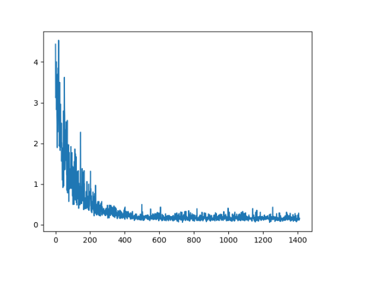

# pytorch-image-captioning

## Abstract
In this project, I have implemented an end-to-end Deep Learning model for Image Captioning. The architecture consists of Encoder and Decoder Networks. Encoder is one of the pre-trained CNN architectures to get image embedding. Decoder is LSTM network with un-intialized word embeddings.

## Dependencies
python3, pytorch, pytorch-vision, pillow, nltk, pickle

## Instructions to run the code

### 1. Pre-Processing
```bash
python3 Preprocess.py
```

### 2. Train 
```bash
python3 train.py -model <encoder_architecture> -dir <train_dir_path> -save_iter <model_checkpoint> -learning_rate <learning_rate> -epoch <re-train_epoch> -gpu_device <gpu_device_number> -hidden_dim <lstm_hidden_state_dim> -embedding_dim <encoder_output>
```
##### args:
```bash
 -model        : one of the cnn architectures - alexnet, resnet18, resnet152, vgg, inception, squeeze, dense
 -dir          : training directory path
 -save_iter    : create model checkpoint after some iterations, default = 10
 -learning_rate: default = 1e-5
 -epoch        : re-train the network from saved checkpoint epoch
 -gpu_device   : gpu device number in case multiple gpus are installed on server
 -hidden_dim   : number of neurons for lstm's hidden state, default = 512
 -embedding_dim: output of cnn encode model, default = 512
```

### 3. Test
```bash
python3 test.py -model <encoder_architecture> -i <image_path> -epoch <saved_model> -gpu_device <gpu_device_number>
```
##### args: 
```bash 
 -i : path of image for generating caption
 ```
 
## Results



## References
 * [Show and Tell: A Neural Image Caption Generator](https://arxiv.org/abs/1411.4555)

 * [Deep Visual-Semantic Alignments for Generating Image Descriptions](https://cs.stanford.edu/people/karpathy/cvpr2015.pdf)
